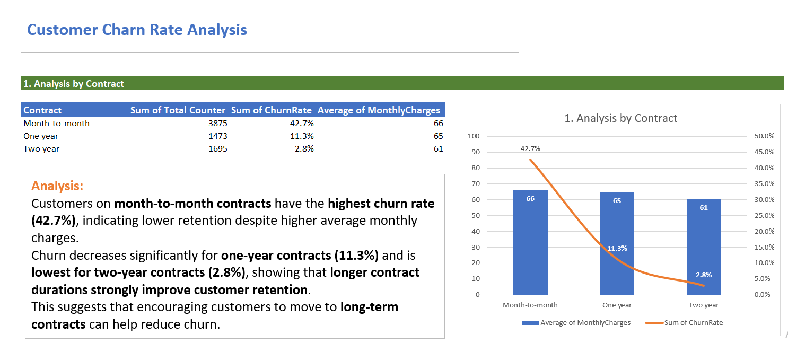
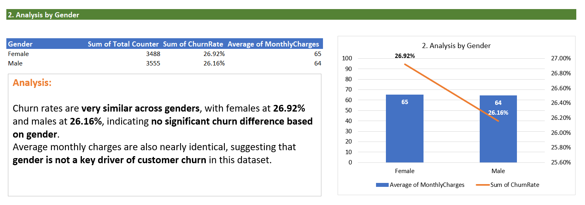
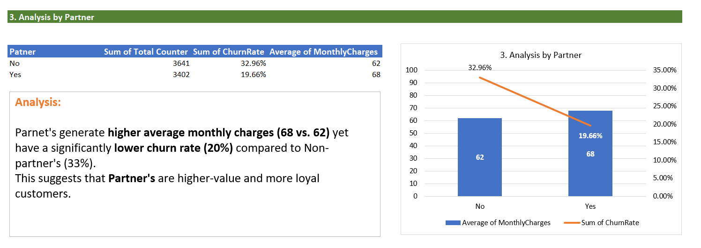

# Customer Churn Rate Analysis Dashboard

## 📌 Project Overview
This project involves a comprehensive analysis of customer churn data using **Microsoft Excel**. The goal is to identify key drivers of customer attrition and provide actionable insights to improve retention rates. The analysis focuses on three main dimensions: Contract Type, Gender, and Partner Status.

## Screen Shots

## 📊 Key Insights & Findings

### 1. Analysis by Contract Type
* **Insight:** Contract duration is the strongest predictor of churn.
* **Data:** Customers on **month-to-month contracts** exhibit the highest churn rate at **42.7%**. In contrast, those on **two-year contracts** have a drastically lower churn rate of **2.8%**.
* **Takeaway:** Encouraging customers to switch to long-term contracts is the most effective lever for reducing churn.

### 2. Analysis by Partner Status
* **Insight:** Customers with a partner are "stickier" and higher value.
* **Data:** Customers with a partner have a significantly lower churn rate (**19.66%**) compared to those without (**32.96%**). Interestingly, partnered customers also generate higher average monthly revenue ($68 vs $62).
* **Takeaway:** "Partner" customers represent a high-value, high-loyalty demographic.

### 3. Analysis by Gender
* **Insight:** Gender is not a determining factor in customer churn.
* **Data:** Churn rates are nearly identical between females (**26.92%**) and males (**26.16%**), as are average monthly charges ($65 vs $64).
* **Takeaway:** Retention strategies should not be segmented by gender as behavior is consistent across this demographic.

## 🛠️ Tools & Techniques Used
* **Microsoft Excel:**
    * **Pivot Tables:** Used to summarize raw data and calculate averages/sums.
    * **Combo Charts:** Utilized dual-axis charts (Clustered Column + Line) to visualize the correlation between *Average Monthly Charges* and *Churn Rate* simultaneously.
    * **Data Cleaning:** Organized raw datasets into clear, analysis-ready formats.
